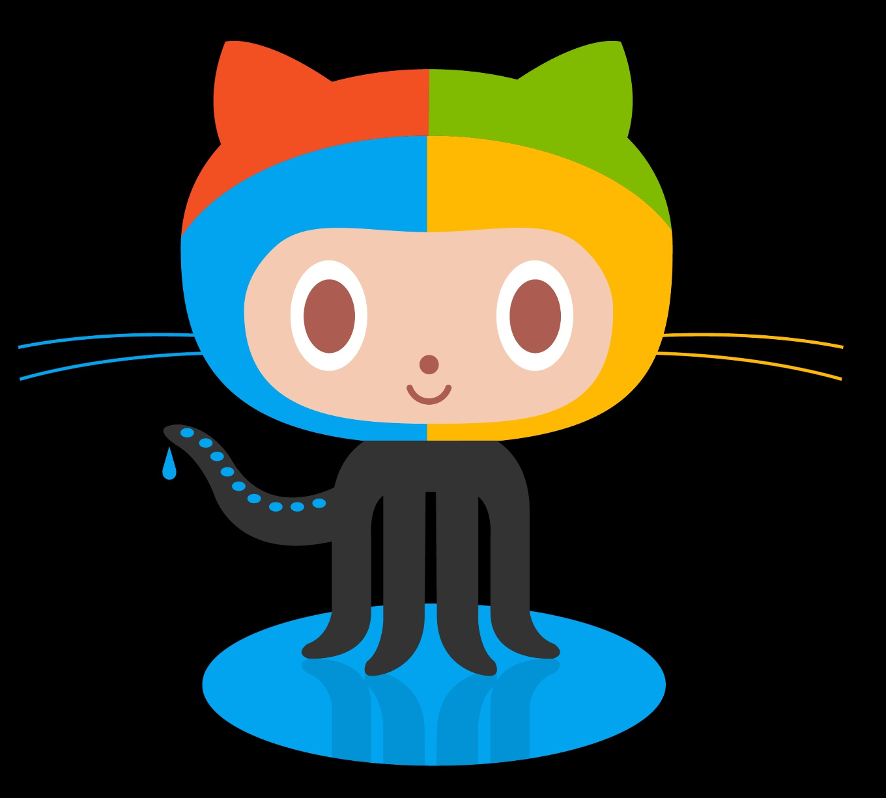

# CIT 281 Project 1

## Learning Objectives

- Basic Unix Shell commands
- Install and Configure Git using the Unix Shell
- Basic Git Commands (add, commit, push, clone)
- Github overview
- Markdown language for README files
- JavaScript ES6+ features
- I learned how to make new directories using GitBash

  

  <a href="https://pages.uoregon.edu/judyl/281/">Judy Lam's 281 website</a>
